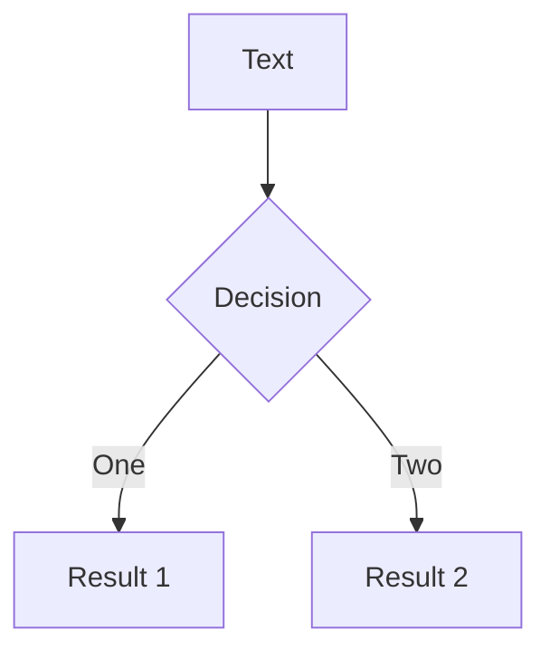

# 一个测试的标题 

## 一个测试的副标题

一个测试的描述

经测试，布局为：cover，才能设置 background

---
layout: cover
---

# 目录
* 01 前言
* 02 主题1
* 03 主题2
* 04 主题3
* 05 主题4

---
layout: center
---

# 01 前言

---

# 关于前言的一些描述

如下是一个 Vue 组件呈现的内容

<Test>
  <template v-slot:left>1</template>
  <template v-slot:right>2</template>
</Test>

---
layout: center
---

# 02 主题1

---

# 关于主题1的一些描述

使用 Mermaid 流程图



---
layout: center
---

# 03 主题2

---

# 关于主题2的一些描述

代码高亮

```js
factorText(data) {
  if (data || data != 'null') {
    let arr = [];

    let factorM = JSON.parse(data);

    if (factorM.length > 0) {
      factorM.forEach((v) => {
        arr.push(v.factorName);
      });
    }
    return arr.join('、');
  } else {
    return '';
  }
}
```

---
layout: center
---

# 04 主题3

---
layout: my-layout
---

<style>
h1 {
  font-size: 30px
}
</style>

::left::

# 这是左边的 slot

::right::

# 这是右边的 slot

---
layout: center
---

# 05 主题4

---
layout: center
---

# 布局：center

测试布局

---
layout: cover
---

# 布局：cover

测试布局

---
layout: default
---

# 布局：default

测试布局

---
layout: end
---

# 布局：end

测试布局

---
layout: fact
---

# 布局：fact

测试布局

---
layout: full
---

# 布局：full

测试布局

---
layout: image-left
image: /img/bg1.jpeg
class: 'text-black'
---

# 布局：image-left

这里测试一下背景图

---
layout: image-right
image: /img/bg1.jpeg
class: 'text-black'
---

# 布局：image-right

这里测试一下背景图

---
layout: image
image: /img/bg1.jpeg
class: 'text-black'
---

# 布局：image

这里测试一下背景图

---
layout: iframe-left
url: https://github.com/slidevjs/slidev
---

# 布局：iframe-left

测试布局

---
layout: iframe-right
url: https://github.com/slidevjs/slidev
---

# 布局：iframe-right

测试布局

---
layout: iframe
url: https://github.com/slidevjs/slidev
---

# 布局：iframe

测试布局

---
layout: intro
---

# 布局：intro

测试布局

---
layout: none
---

# 布局：none

---
layout: quote
---

# 布局：quote

测试布局

---
layout: section
---

# 布局：section

测试布局

---
layout: statement
---

# 布局：statement

测试布局
